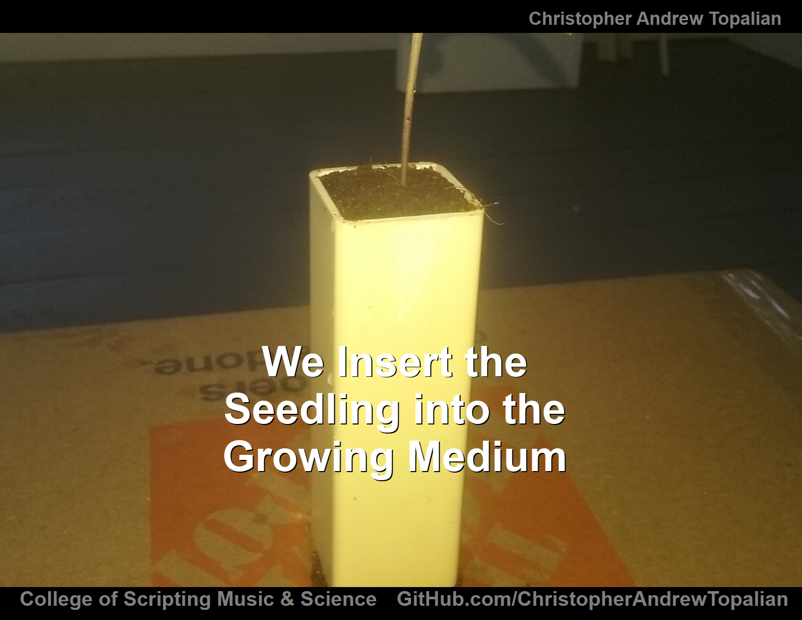

# Botany

### **black_plastic_vhs_container_paper_towels_folded**
Black Plastic VHS Container with Folded Paper Towels for the Seeds to be Placed In

---

### **dark_seed_color_strong_plant**
The Seed Being Dark is a Good Sign that it will be a Strong Plant.

---

### **paper_towel_folded_over_seed_latex_glove_worn**
With a Latex Glove Worn to Avoid Mold Spores, We Fold the Paper Towel Over the Seed.

---

### **hole_in_cap_pours_warm_water_on_paper_towel_seed_location**
Water Bottle Cap with a Hole Pours Warm Water onto the Paper Towel where the Seedling is Located

---

### **incandescent_bulb_heats_up_black_plastic_vhs_container**
Incandescent Bulb is Used to Direct Light onto the Black Plastic VHS Case Surface to Heat Up the Interior.

---

### **laser_thermometer_measures_surface_temperature_black_plastic_vhs_container**
Laser Thermometer Measures Surface Temperature of the Black Plastic VHS Container

---

### **laser_thermometer_measures_inside_temperature_black_plastic_vhs_container**
Laser Thermometer Measures Inside Temperature of the Black Plastic VHS Container

---

### **two_seeds_shown_with_paper_towel_not_yet_folded_over_them**
Two Seeds Shown with the Paper Towel Not Yet Folded Over Them

---

### **two_seeds_shown_paper_towel_not_yet_folded_over_them_close_up**
Two Seeds Shown with the Paper Towel Not Yet Folded Over Them - Close Up

---

### **two_seeds_shown_with_their_tap_roots_emerging_out**
Two Seeds Shown with Their Tap Roots Emerging Out

---

### **two_seeds_shown_with_their_tap_roots_emerging_out_close_up**
Two Seeds Shown with Their Tap Roots Emerging Out Close Up

---

### **we_utilize_a_tall_cylinder_for_tall_plant_growth_using_less_material_005**

A 22" Long by 1.5" Diameter Cylinder requires only 340 grams of Coconut Husk to Solidly Fill to the Top.

This means the Cylinder method is about 95% more efficient than using a 5 gallon pot.

This also uses 95% less Water, and 95% less Fertlizer than a 5 gallon pot.

---

# The Mix: 
70% Coconut Husk
30% Worm Castings

Outcome: Possible Root issues if Perlite is not used.

---

### **square_plastic_table_leg_100g_coconut_husk_100g_worm_castings**

### **square_plastic_table_leg_100g_coconut_husk_100g_worm_castings_002**

### **inserted_plastic_square_leg_into_a_cardboard_box**

### **inserted_plastic_square_leg_sits_on_top_of_a_plastic_saucer**

### **inserted_square_plastic_leg_in_cardboard_box_sitting_on_plastic_saucer**

### **we_insert_the_seedling_into_the_growing_medium**

//----//

// Dedicated to God the Father  
// All Rights Reserved Christopher Andrew Topalian Copyright 2000-2025  
// https://github.com/ChristopherTopalian  
// https://github.com/ChristopherAndrewTopalian  
// https://sites.google.com/view/CollegeOfScripting

