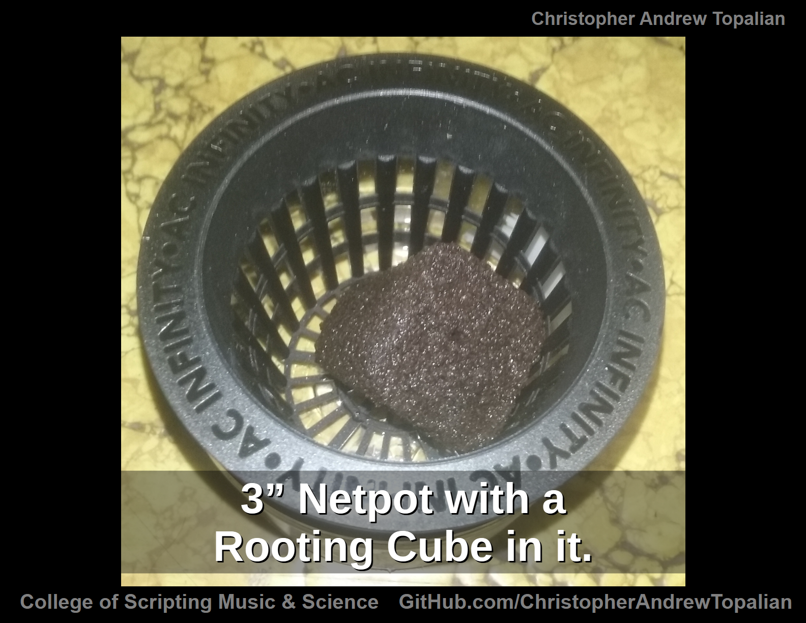

# Botany

### **circle_drawn_on_cardboard_box**
Cardboard box with Circle Ready to be Cut out for the Net Pot

---

### **net_pot_installed_in_cardboard_box_cut_out_hole**
Netpot Installed in the Carboard Box Cut Out Hole

---

### **amount_of_room_under_net_pot_inside_cardboard_box**
Amount of Room Under the Net Pot Inside of the Cardboard Box

---

### **container_under_net_pot_distance**
Container Under the Net Pot which will contain Nutrient Solution. Distance is very close so seedlings can reach it easily.

---

### **three_containers_inside_cardboard_box**
There is Enough Room for 3 Containers of this Size Inside of the Cardboard Box

---

### **closing_cardboard_box**
There are Multiple Ways to Close the Cardboard Box to keep the Light from hitting the Nutrient Solution Container.

---

### **plastic_container_humidity_dome**
Plastic Container Used as a Humidity Dome Placed Over the New Seedling.

---

### **cardboard_box_system_summarized**
Plastic Container Humidity Dome on top of the Net Pot which is Installed in the Cardboard Box with Nutrient Container Inside of the Box.

---

### **three_inch_net_pot_with_rooting_cube**
3 Inch Netpot with a Rooting Cube in it.

---

### **coconut_husk_to_be_inserted_under_and_around_rooting_cube**
Coconut Husk to be Inserted Under and Around the Rooting Cube

---

### **coconut_husk_inserted_under_and_around_rooting_cube**
Coconut Husk Inserted Under and Around the Rooting Cube

---

### **black_plastic_vhs_container_paper_towels_folded**
Black Plastic VHS Container with Folded Paper Towels for the Seeds to be Placed In

---

### **dark_seed_color_strong_plant**
The Seed Being Dark is a Good Sign that it will be a Strong Plant.

---

### **paper_towel_folded_over_seed_latex_glove_worn**
With a Latex Glove Worn to Avoid Mold Spores, We Fold the Paper Towel Over the Seed.

---

### **hole_in_cap_pours_warm_water_on_paper_towel_seed_location**
Water Bottle Cap with a Hole Pours Warm Water onto the Paper Towel where the Seedling is Located

---

### **incandescent_bulb_heats_up_black_plastic_vhs_container**
Incandescent Bulb is Used to Direct Light onto the Black Plastic VHS Case Surface to Heat Up the Interior.

---

### **laser_thermometer_measures_surface_temperature_black_plastic_vhs_container**
Laser Thermometer Measures Surface Temperature of the Black Plastic VHS Container

---

### **laser_thermometer_measures_inside_temperature_black_plastic_vhs_container**
Laser Thermometer Measures Inside Temperature of the Black Plastic VHS Container

---

### **two_seeds_shown_with_paper_towel_not_yet_folded_over_them**
Two Seeds Shown with the Paper Towel Not Yet Folded Over Them

---

### **two_seeds_shown_paper_towel_not_yet_folded_over_them_close_up**
Two Seeds Shown with the Paper Towel Not Yet Folded Over Them - Close Up

---

### **two_seeds_shown_with_their_tap_roots_emerging_out**
Two Seeds Shown with Their Tap Roots Emerging Out

---

### **two_seeds_shown_with_their_tap_roots_emerging_out_close_up**
Two Seeds Shown with Their Tap Roots Emerging Out Close Up

---

### **two_germination_chambers_with_added_water_above_and_water_below**
Two Germination Chambers with Added Water Above & Water Below

---

### **spray_water_with_spray_bottle_inside_top_dome**
We Spray Water with a Spray Bottle Inside of the Top Dome to Water Them

---

### **light_on_lowest_setting_7_inches_from_top_of_dome_170_ppfd**
The Light On Its Lowest Setting is About 7” Over the Top of the Dome. 170 PPFD Was Measured Using a Cell Phone Light Sensor App

---

### **sprout_shown_inside_of_germination_chamber**
We See the Sprout Inside of the Germination Chamber

---

### **sprout_shown_without_plastic_dome_on_top**
We See the Sprout  Without the Plastic Dome On Top

---

### **bottom_half_of_germination_chamber_water_added_up_to_bottom_of_net_pot**
Here is the Bottom Half of the Germination Chamber with Net Pot. We Add Water Up To the Bottom of the Net Pot

---

### **lid_on_top_of_germination_chamber**
We Seal Our Germination Chamber with a Plastic Lid On Top. Water is in the Bottom Container the Net Pot is Sitting In

---

### **nitrification_tower_summarized**
Nitrification Tower Made by Drilling Holes in the Bottom of a Plastic Container, Filling it with Soil and Adding Urine Daily

---

### **hose_on_top_of_nitrification_tower_outside**
A Funnel Inside of the House with a 6 Foot Hose Directs Urine into the Nitrification Tower Outside on the Ground.

---

### **hose_on_top_of_nitrification_tower_outside_closer**
A Funnel Inside of the House with a 6 Foot Hose Directs Urine into the Nitrification Tower Outside on the Ground.

---

### **hose_on_top_of_large_nitrification_tower_outside**
A Funnel Inside of the House with a 6 Foot Hose Directs Urine into the Nitrification Tower Outside on the Ground.

---

### **funnel_with_hose_directs_urine_to_nitrification_tower_outside**
A Funnel with a 6 Foot Hose is Urinated in Daily Directing the Urine into the Nitrification Tower, which is Outside

---

### **funnel_with_hose_directs_urine_to_nitrification_tower_outside_top_view**
A Funnel with a 6 Foot Hose is Urinated in Daily Directing the Urine into the Nitrification Tower, which is Outside

---

### **Soil**

### **soak_soil_multiple_days_in_hydrogen_peroxide_water_to_reduce_pests**

---

//----//

// Dedicated to God the Father  
// All Rights Reserved Christopher Andrew Topalian Copyright 2000-2025  
// https://github.com/ChristopherTopalian  
// https://github.com/ChristopherAndrewTopalian  
// https://sites.google.com/view/CollegeOfScripting

