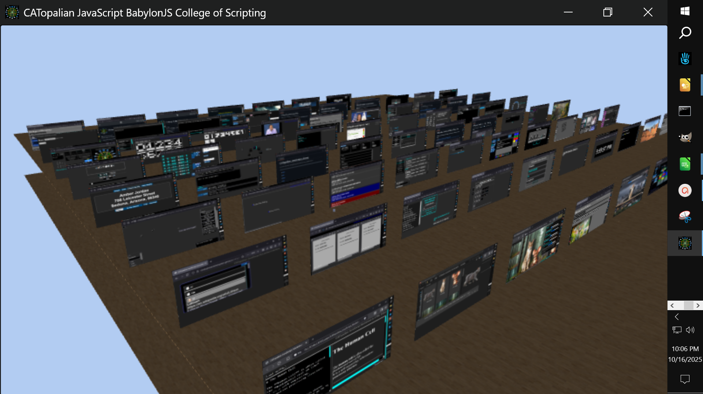

# CATopalian JavaScript BabylonJS College of Scripting
Presenting the **College of Scripting Music and Science** in 3D :-) using **JavaScript** **Babylon.js**

Video: https://www.youtube.com/watch?v=4S4gkrVrXkM

Video: https://www.youtube.com/watch?v=tZFTY5LSRvs

Use App: https://christopherandrewtopalian.github.io/CATopalian_JavaScript_BabylonJS_College_of_Scripting/CATopalian_JavaScript_BabylonJS_College_of_Scripting/CATopalian_JavaScript_BabylonJS_College_of_Scripting.html

---

# Requirements
### NW.js https://nwjs.io/

Drag the **folder** named **CATopalian_JavaScript_BabylonJS_College_of_Scripting** onto the **nw.exe** icon

---

### How to Download this App
1. **Click** the green **Code Button** on this github page
2. Choose **Download ZIP**
3. **Save** the Zip File
4. **Extract All**
5. **Double click** the **HTML file** to start the App

---

Happy Scripting :-)

